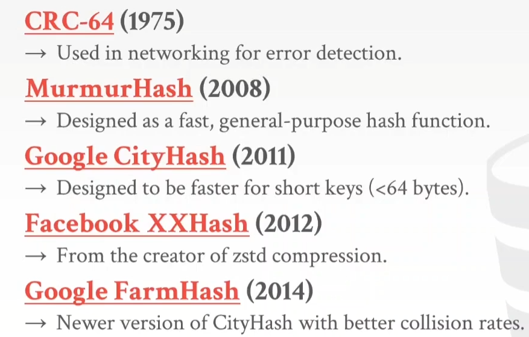

# 0. Relational Model & Algebra

## 0.1 Data Models
- **Data Model**: A collection of concepts for describing data, data relationships, data semantics, and constraints.
- **Relational Model**: A data model based on first-order predicate logic, modeling data as relations (tables).
- **Schema**: A description of a data model, specifying the data structure and constraints.

## 0.2 Relational Model
- **Relation**: A table of data, with each row representing an entity and each column representing an attribute.
- **Tuple**: A row in a relation, representing an entity. Each tuple has the same number of attributes.
- **Attribute**: A column in a relation, representing a property of an entity.
- **Domain**: The set of possible values for an attribute.
- **Relation Schema**: The name of a relation and the set of attributes it contains.
- **Relation Instance**: A set of tuples that conform to a relation schema.
- **Key**: A set of attributes that uniquely identify a tuple in a relation.
- **Primary Key**: A minimal superkey. A superkey is a set of attributes that uniquely identifies a tuple in a relation. A minimal superkey is a superkey that cannot be reduced to a smaller set of attributes.
- **Foreign Key**: A set of attributes that refer to the primary key of another relation.

## 0.3 New Hotness
- **Vector Databases**: Vector databases are designed for nearest-neighbor searches on floating-point arrays, often used to store and retrieve embeddings. These embeddings, generated by machine learning models, represent the features of text, images, audio, or other complex data.
- 
- **Document & JSON Databases**: Document model: MongoDB, CouchDB