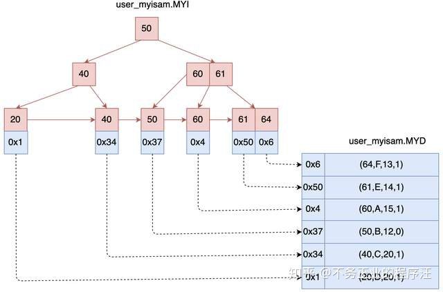

# B+树
B+树（B+ Tree）是B树的一种变体，广泛应用于数据库系统和文件系统的索引结构。

## 1. B+树性质
与B树相比，B+树在结构上有一些改进，特别是在提高查询效率、范围查找性能和磁盘I/O效率等方面更具优势

### 1.1 B+树与B树的主要区别在于：
- **所有键值存储在叶子节点**：B+树的内部节点只存储键值用于导航，而不存储实际数据。所有实际数据存储在叶子节点中。
- **叶子节点之间有链表结构**：B+树的叶子节点通过指针串联成一个双向链表，以方便范围查询和顺序遍历。
- **内节点不存储实际数据**：内节点只用于引导查找路径，数据只保存在叶子节点。

### 1.2 B+树性质:
- **每个节点最多包含m个子节点**：B+树的每个节点最多包含m个子节点。
  - **每个节点包含 m/2 ~ m 个子节点**
  - **每个节点包含 m/2 ~ m 个键值**
- **叶子节点包含所有键值和对应的数据指针**：这些键值按照递增顺序排列，并通过链表连接，支持快速范围查询。
- **树的平衡性**：B+树始终保持平衡，所有叶子节点位于同一层，查找的时间复杂度为 O(log⁡n)。

---

## 2 B+树的结构与操作:

### 2.1 查找操作
在B+树中查找一个键值的过程与B树类似，但有一些差异：
1. 从根节点开始，沿着索引路径向下查找，直到找到包含该键值的叶子节点。
2. 在叶子节点中，通过二分查找或顺序查找找到对应的键值。
   查找操作的时间复杂度为 O(log⁡n)，其中 n 是树中存储的总键值数量。

### 2.2 插入操作
在B+树中插入一个键值的过程如下：
1. 从根节点开始，沿着索引路径向下查找，直到找到包含该键值的叶子节点。
2. 在叶子节点中，插入键值，并保持叶子节点的有序性。
3. 如果叶子节点已满（包含 m 个键值），则将该节点分裂为两个节点，并将中间键值上移到父节点。
4. 如果父节点已满，则继续分裂父节点，并将中间键值上移到更高层次的节点。

#### 插入的总时间复杂度
    - `N`：存储的总键数。
    - `m`：每个节点的最大度数。
- **平均复杂度：** `O(log_m(N))`
   - 通常只需找到叶子节点并插入即可。
- **最坏复杂度：** `O(m * log_m(N))`
   - 当插入引发频繁的节点分裂时，需调整从叶子节点到根节点的所有节点。

### 2.3 删除操作
在B+树中删除一个键值的过程如下：
1. 从根节点开始，沿着索引路径向下查找，直到找到包含该键值的叶子节点。
2. 在叶子节点中，删除键值。
3. 如果删除后叶子节点中的键值数量小于 m/2，则需要从兄弟节点借位或将其与兄弟节点合并。若父节点也受到影响，则继续向上调整。
删除操作的最坏时间复杂度为 O(log⁡n)，因为最多需要调整到根节点。

## 3. 非唯一索引：**Non-Unique Indexes**

在B+树中处理非唯一索引（Non-Unique Indexes）的方法有两种：

1. 重复键（Duplicate Keys）：
    - 在这种方法中，使用相同的叶子节点布局，但是重复的键会被多次存储。
    - 当存在多个记录具有相同键值时，它们都会被存储在相同的叶子节点中。
    - 例如，考虑一个存储学生信息的B+树索引，如果多个学生具有相同的姓氏，那么它们的记录将被存储在相同的叶子节点中。

2. 值列表（Value Lists）：
    - 在这种方法中，每个键只会存储一次，并维护一个包含唯一值的链表。
    - 当存在多个记录具有相同键值时，它们的值会被添加到键的值列表中。
    - 例如，考虑一个存储销售订单的B+树索引，如果多个订单具有相同的日期，那么它们的订单号将被添加到日期键的值列表中。

这两种方法在处理非唯一索引时有不同的权衡：
- 重复键的方法可以简化叶子节点的布局，因为重复的键可以直接存储在相同的叶子节点中。然而，这可能会导致存储空间的浪费，因为重复的键会被多次存储。
- 值列表的方法可以减少存储空间的消耗，因为每个键只存储一次，并通过链表维护唯一值。然而，这可能会增加查询时的开销，因为需要在值列表中搜索具体的记录。

## 4. 重复键：**Duplicate Keys**
在B+树中，重复键（Duplicate Keys）是指具有相同键值的多个记录。处理重复键的方法有两种：

1. 将记录ID附加为键的一部分：
    - 这种方法将每个记录的唯一标识（如记录ID）与键值一起存储。通过将记录ID作为键的一部分，确保了每个键的唯一性。
    - 当存在重复键时，不同的记录会具有不同的记录ID，从而区分相同的键。

2. 允许叶节点溢出到包含重复键的溢出节点：(❌破坏查找时间复杂度)
    - 在这种方法中，当叶节点无法容纳所有具有相同键的记录时，它们会溢出到一个或多个溢出节点中。
    - 溢出节点包含了重复键的记录，但不存储冗余信息。它们通常通过链表或其他数据结构连接在一起。

这两种方法各有优缺点：
- 将记录ID作为键的一部分可以简单地区分具有相同键的记录，并且对于查询和索引操作而言是有效的。但是，它会增加每个键的存储空间需求。
- 允许叶节点溢出到溢出节点的方法可以节省存储空间，因为重复键的记录不会存储冗余信息。然而，这种方法会增加B+树的维护复杂度和查询操作的复杂性。

## 5. MYSQL引擎MyISAM数据和索引的关系
在MySQL中，MyISAM引擎使用B+树作为索引结构。MyISAM引擎将数据和索引分开存储，数据存储在数据文件中，索引存储在索引文件中。
MYD：数据文件，所有的数据保存在这个文件中。 MYI：索引文件。

## 6.聚簇索引 Clustered Indexes

聚簇索引（Clustered Index）是一种特殊的数据库索引，它决定了表中数据的实际存储顺序。可以简单理解为：数据按照主键排序直接存储在磁盘上。

---

### **聚簇索引的特点**
1. **数据的物理存储顺序**
    - 表中的数据按照聚簇索引的排序顺序存储，意味着主键相近的行在物理上也挨在一起。
    - 这使得查询相邻数据变得更快。

2. **主键排序**
    - 聚簇索引通常是基于主键建立的，主键必须唯一。
    - 如果没有定义主键，数据库可能会自动生成一个隐藏的标识符作为主键。

3. **性能优势**
    - 对于按主键查询或范围查询的操作，性能更高，因为数据在磁盘上是连续存储的，这减少了磁盘寻址的时间。

4. **限制**
    - 并非所有数据库系统（DBMS）都支持聚簇索引。某些系统可能完全没有这种概念，或者只能在特定情况下使用。

---

### **MySQL 引擎 Innodb 中的聚簇索引**

在 MySQL 中，Innodb 引擎以主键索引的方式存储数据。简单来说，表中的数据直接存放在主键索引的叶子节点上。

#### 主键索引示意图：

如图所示：
- 叶子节点的数据区直接保存了真实的数据行。
- 检索数据时，通过主键索引命中叶子节点后，可以直接获取行数据。

#### 辅助索引的结构：

如图所示：
- **辅助索引的叶子节点** 保存的是主键值，而不是数据本身。
- 如果通过辅助索引查询数据，则需要以下两步：
    1. **第一步**：在辅助索引中找到目标值（例如 `name = C`），得到对应的主键值（例如 `id = 9`）。
    2. **第二步**：回到主键索引，根据主键值 `id = 9`，在叶子节点中找到真实数据。

#### 为什么辅助索引不直接存储数据？
- 如果辅助索引直接存储数据行，当数据迁移时（例如行位置改变），就需要同时更新所有索引，非常麻烦。
- 因此，Innodb 通过辅助索引指向主键索引来避免这种问题。

---

### **小结**
- 聚簇索引让数据存储和主键排序一致，查询效率更高。
- 辅助索引虽然多了一次“回表”操作，但能更好地保证数据的一致性。
- 从 MySQL 5.5 开始，默认存储引擎改为 Innodb，它全面支持聚簇索引，为性能优化提供了更强的基础。

