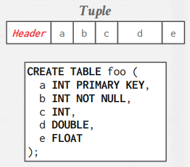

# 1. 数据库存储简介

构建DBMS包括五大核心内容：
- **存储（Storage）**：以磁盘为主的存储体系。
- **执行（Execution）**：通过执行引擎实现查询。
- **并发控制（Concurrency Control）**：管理事务一致性。
- **恢复（Recovery）**：保证数据持久化和一致性。
- **分布式数据库（Distributed Database）**：管理跨节点的数据。

---

## 1.1 存储体系结构

### 1.1.1 存储层级
- **离CPU越近**：速度越快，存储量较小（如寄存器和缓存）。
- **离CPU越远**：容量较大，但速度较慢（如硬盘和网络存储）。


### 1.1.2 设备类型
- **易失性存储**：如RAM，支持快速随机访问，但断电数据丢失。
- **非易失性存储**：如HDD/SSD，断电后数据保留，但块级访问较慢。
- **新兴存储**：如云存储、持久化内存（PM），速度快但价格高。


---

## 1.2 Disk-Oriented DBMS

- 数据组织为**页（Page）**，DBMS通过 **缓冲池（Buffer Pool）** 在内存和磁盘之间管理数据。
- DBMS需要将数据移入内存中来操作数据。这是通过利用**buffer pool**来管理内存和磁盘间数据的移动。 
- DBMS有一个**execution engine**来执行查询，execution engine向buffer pool索要特定的页，buffer pool将会负责将页移入内存中，并给execution engine指向这个页的指针。


- **页分类**：
    - **硬件页**：如4KB，支持原子写操作。
    - **数据库页**：如8KB/16KB，逻辑单位由DBMS定义。
- **DBMS设计目标**：
    - 让DBMS可以处理比内存空间更大的数据库，就是用Disk-Oriented DBMS。
    - 数据库不可能时时刻刻把数据写到硬盘上，因为太慢了，也不可能直接操作硬盘。我们的DBMS就要负责解决如何在非易失的磁盘和易失的内存之间移动数据，来减少长时间的等待和性能退化。
    - 对非易失存储的连续存取远远快于随机的存取。而用户的请求可能是不连续的，DBMS想最大化连续存取，减少读写不连续的页。

---

## 1.3 DBMS vs. OS

### 1.3.1 mmap的问题
1. **事务安全性**：OS可能在任意时间写回脏页，打破事务的原子性。
2. **I/O 停滞**：DBMS无法判断哪些页在内存中，一旦发生缺页会阻塞。
3. **错误处理**：OS隐藏数据传输过程，DBMS难以及时校验错误。
4. **性能问题**：如TLB击穿会造成性能瓶颈。

### 1.3.2 DBMS优化
- 自行管理脏页写回磁盘时机。
- 支持预取（Prefetching）。
- 定制缓冲替换策略和线程调度。

---

数据库存储涉及两个关键问题：

1. **文件表示**：DBMS如何表示存储在磁盘上的数据库文件。
2. **数据管理**：DBMS如何高效管理内存和磁盘之间的数据移动。


---

## 1.4 文件存储（File Storage）

在DBMS中，数据库以**文件**的形式存储在磁盘上。OS仅知道文件存在，但不了解其具体编码格式，所有解析操作由DBMS完成。

### 1.4.1 Storage Manager
- **职责**：管理数据库文件，通过调度读写优化页的时间和空间局部性。
- **核心逻辑**：将文件组织为页集合，并维护读写状态及空闲空间信息。

### 1.4.2 数据库页（Database Pages）
- **定义**：固定大小的块，可包含元组、元数据、索引或日志记录等。
- **要求**：部分系统要求页具备**自描述性**（self-contained），即能够解释自身内容。
- **标识**：每个页需唯一标识符（Page ID）。

页分类：
- **硬件页**：通常为4KB，保证写入原子性。
- **数据库页**：大小范围1~16KB（如SQLite为4KB，PostgreSQL为8KB，MySQL为16KB）。

如果数据库页大于硬件页，则需额外设计保证写入原子性。

---

### 1.4.3 如何在文件中组织页面: 堆文件（Heap File）
- **定义**：页的无序集合，页中的元组也无序排列。
- **操作**：支持创建、查找、修改、删除和遍历所有页。
- **寻址逻辑**：对于单文件存储，可直接根据页偏移量计算页位置。


对于多文件存储，需使用元数据记录页的分布及状态（空闲空间等）。  
DBMS通常通过**特殊页**记录每个页的位置和相关元信息。


---

## 1.5 页结构（Page Layout）

### 1.5.1 页头（Header）
记录页的元信息，例如：
- Page Size
- Checksum
- DBMS Version
- Transaction Visibility
- Compression Information
- Self-containment

### 1.5.2 插槽页（Slotted Pages）
为优化存储和管理元组，DBMS采用插槽页结构：
- **插槽数组**：记录每个元组的起始偏移。
- **存储规则**：元组数据从尾部开始，插槽数组从头部扩展。
- **碎片处理**：删除元组后，可移动元组填补空隙，保持插槽位置不变。


元组删除示例：删除`Tuple 3`后，将`Tuple 4`前移，同时更新插槽指针。


---

### 1.5.3 记录ID（Record ID）
- **定义**：物理元组的唯一标识。
- **格式**：常见为 `Page ID + Offset` 或 `Page ID + Slot ID`。

---

## 1.6 元组结构（Tuple Layout）

### 1.6.1 元组结构
1. **元组头部**：包含元信息（如事务可见性、NULL值位图等）。
2. **元组数据**：实际属性值，按列定义顺序存储。

### 去规范化存储
- 将相关表数据预联结后存储在同一页中，提升读取效率。
- 代价：增加存储开销和更新复杂度。

---

## 1.7 日志文件组织

顺序的向页面中追加每一个数据库操作

这种组织方式的写入很快，因为都是顺序IO，但在读取时则需要通过向上扫描日志来重建我们需要的元组。比如有如下日志：

```
INSERT id=1, col1=a, col2=b
a lots of log entries
UPDATE id=1, col1=z
```

我们必须从最后一个UPDATE读到最前面才知道id=1的这条记录的所有字段内容。

### 加速读取：

- 建立索引，以可以直接找到对应id的一批记录（但顺序写入的优势就降低了）
- 定期压缩，日志文件组织随着时间推移肯定会有很多无用的内容，需要定期压缩以减少向上扫描时的浪费
- 使用日志文件组织的数据库：HBASE、cassandra、levelDB、RocksDB

## 1.8 数据库工作负载
- **在线事务处理 OLTP（Online Transaction Processing）**：每次只读/更新少量数据的快速操作，重点在于处理大量这样事务的并发。
- **在线分析处理 OLAP（Online Analytical Processing）**：读取大量数据并计算聚合的复杂查询。
- **混合事务分析处理（HTAP）**：OLTP + OLAP在一个数据库实例中

常见的公司的做法是：
1. 部署OLTP数据桶 + OLAP数据仓
2. 所有事务在OLTP侧发生，通过ETL（提取、转换、加载）过程被周期性推送到OLAP数据仓（比如一天一次）
3. OLAP进行分析计算，得出一些分析结果
4. 如果需要的话，也有可能将分析结果推送回OLTP侧

## 结论

1. **数据库页**：DBMS组织数据为页，并根据不同需求优化布局。
2. **页管理方式**：
  - 页目录：记录页的位置和状态。
  - 堆文件：无序存储页,有链表和目录页两种实现。
3. **元组存储方式**：
  - 插槽页：优化存储和碎片管理。
  - 元组头部：存储元信息。
  - 数据部分：实际属性值。
4. **DBMS优化目标**：
  - 减少I/O开销。
  - 提升读写性能。

### 操作示例

#### 插入元组：
1. 检查页目录，找到具有空闲插槽的页。
2. 若页不在内存中，从磁盘读取。
3. 更新插槽数组，插入元组到合适位置。

#### 更新元组：
1. 检查页目录，定位元组所在页。
2. 若页不在内存中，从磁盘读取。
3. 根据插槽指针查找元组偏移。
4. 若数据大小未改变，直接覆盖，否则需重新分配空间。
